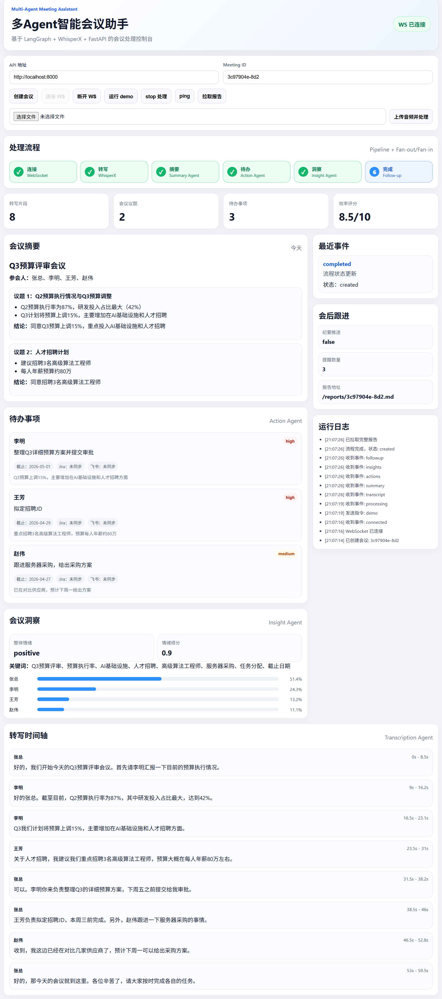

# 多Agent智能会议助手

基于 `LangGraph + FastAPI + WebSocket` 的会议自动化系统，覆盖转写、摘要、待办抽取、洞察分析、会后跟进全流程。



## 当前实现能力

- 5-Agent 编排：`transcription -> (summary/action/insight 并行) -> followup`
- 音频处理：WhisperX 转写 + 可选说话人识别（`HF_TOKEN`）
- LLM：DeepSeek API（OpenAI 兼容接口）
- 外部同步：Jira Cloud / 飞书任务与消息推送
- 工程韧性：
  - 并行状态合并（LangGraph reducer）
  - 外部调用重试（tenacity 指数退避）
  - 熔断器（DeepSeek / Jira / 飞书）
  - 待办幂等（SQLite 唯一键防重复创建）

## 技术栈

- Agent 编排：`langgraph`
- 服务层：`fastapi`、`websockets`、`uvicorn`
- 语音转写：`whisperx`、`pyannote.audio`
- LLM 调用：`httpx`（DeepSeek API）
- 集成：`jira`、飞书 Open API
- 数据模型：`pydantic`
- 韧性组件：`tenacity` + 自定义 `circuit_breaker` + `idempotency_store`

## 快速开始

### 1) 安装依赖

```bash
python -m venv .venv
# Windows:
.venv\Scripts\activate
# macOS/Linux:
# source .venv/bin/activate

pip install -r requirements.txt
```

### 2) 配置环境变量

项目根目录已提供 `.env` 模板，至少需要配置：

```env
DEEPSEEK_API_KEY=your_key
```

可选配置（按需）：

- Whisper：`WHISPER_MODEL_SIZE`、`WHISPER_DEVICE`、`WHISPER_LANGUAGE`、`HF_TOKEN`
- Jira：`JIRA_SERVER`、`JIRA_EMAIL`、`JIRA_API_TOKEN`、`JIRA_PROJECT_KEY`
- 飞书：`FEISHU_APP_ID`、`FEISHU_APP_SECRET`、`FEISHU_WEBHOOK_URL`
- 幂等存储：`IDEMPOTENCY_DB_PATH`
- 熔断参数：
  - `DEEPSEEK_CIRCUIT_*`
  - `JIRA_CIRCUIT_*`
  - `FEISHU_CIRCUIT_*`

### 3) 启动后端

```bash
python -m src.main
```

启动后可访问：

- API 文档：`http://localhost:8000/docs`
- WebSocket：`ws://localhost:8000/ws/meeting/{meeting_id}`

### 4) 测试 Demo（无需音频）

```bash
curl -X POST http://localhost:8000/api/v1/meeting/demo/demo
```

## 前端控制台（React + Vite）

已提供 `frontend/` 用于联调 WebSocket 与 REST。

```bash
cd frontend
npm install
npm run dev
```

- 前端：`http://localhost:5173`
- 后端：`http://localhost:8000`

## 核心目录

```text
src/
├── agents/
│   ├── transcription_agent.py   # 转写
│   ├── summary_agent.py         # 摘要
│   ├── action_agent.py          # 待办提取 + 外部同步（含幂等）
│   ├── insight_agent.py         # 洞察分析
│   └── followup_agent.py        # 跟进汇总
├── graph/
│   └── meeting_graph.py         # LangGraph 编排与状态合并
├── integrations/
│   ├── deepseek_client.py       # DeepSeek 客户端（含熔断）
│   ├── jira_client.py           # Jira 客户端（含熔断）
│   ├── feishu_client.py         # 飞书客户端（含熔断）
│   ├── idempotency_store.py     # 幂等存储（SQLite）
│   └── circuit_breaker.py       # 通用熔断器
├── models/
│   └── schemas.py               # 数据模型
├── websocket/
│   └── server.py                # FastAPI + WebSocket
└── main.py                      # 启动入口
```
